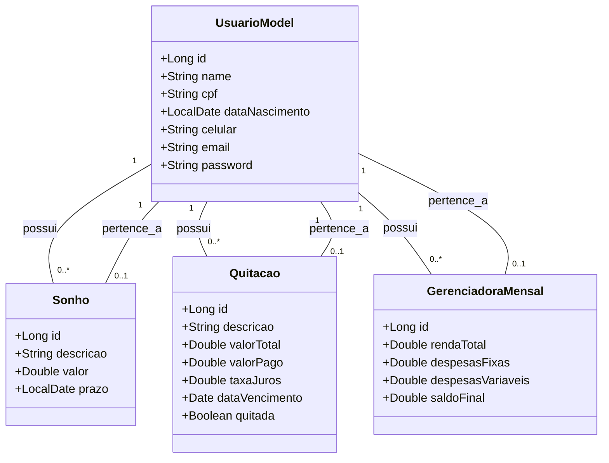

# GDS
Projeto relacionado ao tema de "Acesso à Serviços Financeiros", sendo nós, a GDS - a "Gestão de Sonhos" - como prosta de intervenção para o atual cenário financeiro brasileiro.

```mermaid

classDiagram
    class UsuarioModel {
        +Long id
        +String name
        +String cpf
        +LocalDate dataNascimento
        +String celular
        +String email
        +String password
    }

    class Sonho {
        +Long id
        +String descricao
        +Double valor
        +LocalDate prazo
    }

    class Quitacao {
        +Long id
        +String descricao
        +Double valorTotal
        +Double valorPago
        +Double taxaJuros
        +Date dataVencimento
        +Boolean quitada
    }

    class GerenciadoraMensal {
        +Long id
        +Double rendaTotal
        +Double despesasFixas
        +Double despesasVariaveis
        +Double saldoFinal
    }

    UsuarioModel "1" -- "0..*" Sonho : possui
    UsuarioModel "1" -- "0..*" Quitacao : possui
    UsuarioModel "1" -- "0..*" GerenciadoraMensal : possui
    Sonho "0..1" -- "1" UsuarioModel : pertence_a
    Quitacao "0..1" -- "1" UsuarioModel : pertence_a
    GerenciadoraMensal "0..1" -- "1" UsuarioModel : pertence_a


```
